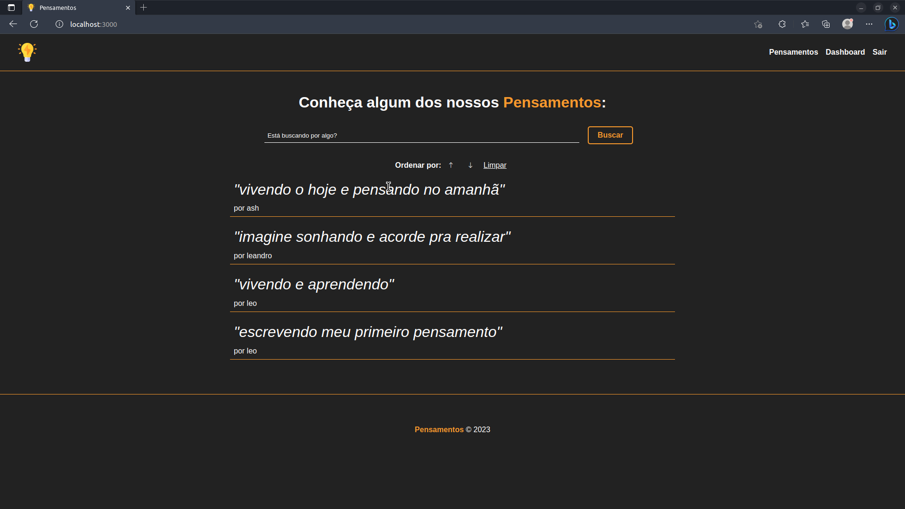
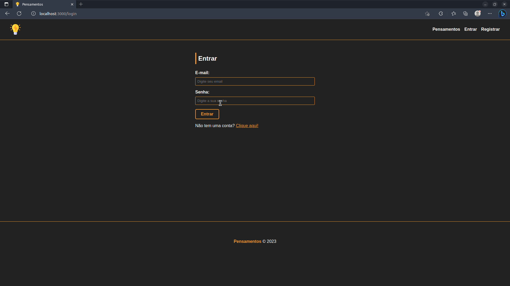
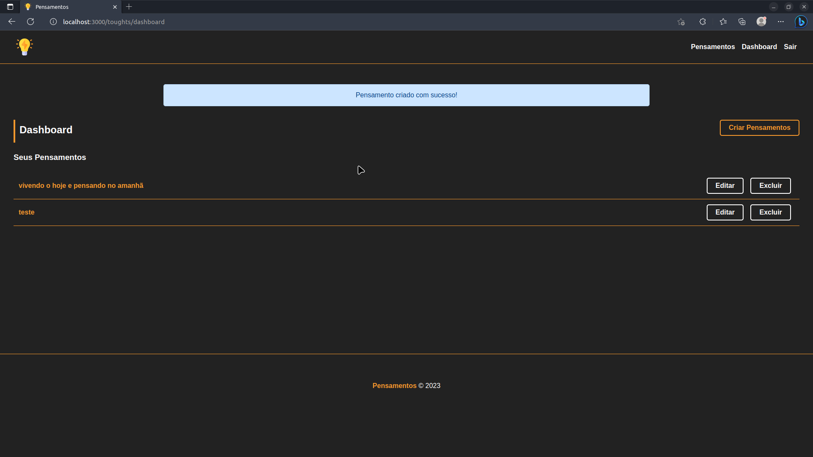
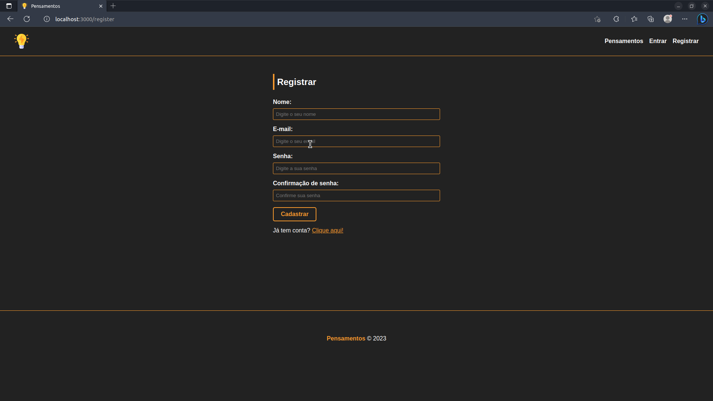
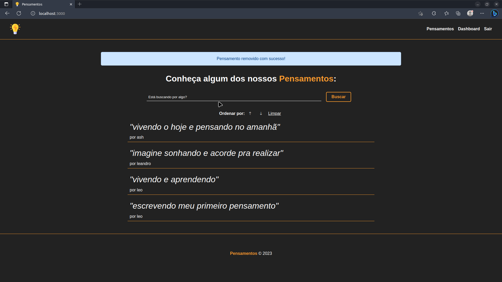

<h1 align="center">
     :computer: <a href="#" alt="site do projeto"> Pensamentos </a>
</h1>

<h3 align="center">
   Uma ferramenta prática para registrar e organizar ideias, promovendo a criatividade e autoconhecimento dos usuários.
</h3>

<p align="center">
  

  
  
  <a href="https://github.com/Felix566/Template_Readme/commits/master">
    
  </a>
    
   
   <a href="https://github.com/Felix566/Template_Readme/stargazers">
    
  </a>
</p>

<h4 align="center">
	:construction: Finalizado :construction:
</h4>

<p align="center">
 <a href="#-sobre-o-projeto">Sobre</a> •
 <a href="#-funcionalidades">Funcionalidades</a> •
 <a href="#-layout">Layout</a> • 
 <a href="#-como-executar-o-projeto">Como executar</a> • 
 <a href="#-tecnologias">Tecnologias</a> • 
 <a href="#-contribuidores">Contribuidores</a> • 
 <a href="#-autor">Autor</a> • 
 <a href="#user-content--licença">Licença</a>
</p>

## :computer: Sobre o projeto
O Pensamentos é uma aplicação web intuitiva para organizar e armazenar pensamentos dos usuários, com recursos de categorização e pesquisa. Estimule sua criatividade, acompanhe seu crescimento pessoal e compartilhe pensamentos com essa ferramenta fácil de usar.
---
## :gear: Funcionalidades
- [x] Criação, edição e exclusão de pensamentos;
- [x] Busca por palavras ou frases;
- [x] Criação de usuários;
- [x] Organização por ordem de criação dos pensamentos;
- [x] Autenticação de usuário;
- [x] Interface intuitiva.
---
## :art: Layout
### Web
Alguns prints de telas da aplicação:
<p align="center" style="display: flex; align-items: flex-start; justify-content: center;">
  
  
  
  
  
</p>


## :rocket: Como executar o projeto
### Pré-requisitos
Antes de começar, você vai precisar ter instalado em sua máquina as seguintes ferramentas:
[Git](https://git-scm.com), [Node.js](https://nodejs.org/en/). 
Além disto é bom ter um editor para trabalhar com o código como [VSCode](https://code.visualstudio.com/) e ter instalado e previamente configurado em sua máquina o Mysql e Mysql workbench.

#### :game_die: Rodando a aplicação

```bash
# Clone este repositório
$ git clone https://github.com/Felix566/Projeto-Pensamentos.git
# Acesse a pasta do projeto no terminal/cmd
$ cd Projeto-Pensamentos
# Instale as dependências
$ npm install
# Execute a aplicação em modo de desenvolvimento
$ npm run start
# O servidor inciará na porta:3000 - acesse http://localhost:3000
```
---

## :hammer_and_pick: Tecnologias

As seguintes ferramentas foram usadas na construção do projeto:

-   **NodeJs**
-   **Express**
-   **Sequelize**
-   **Mysql**
---
